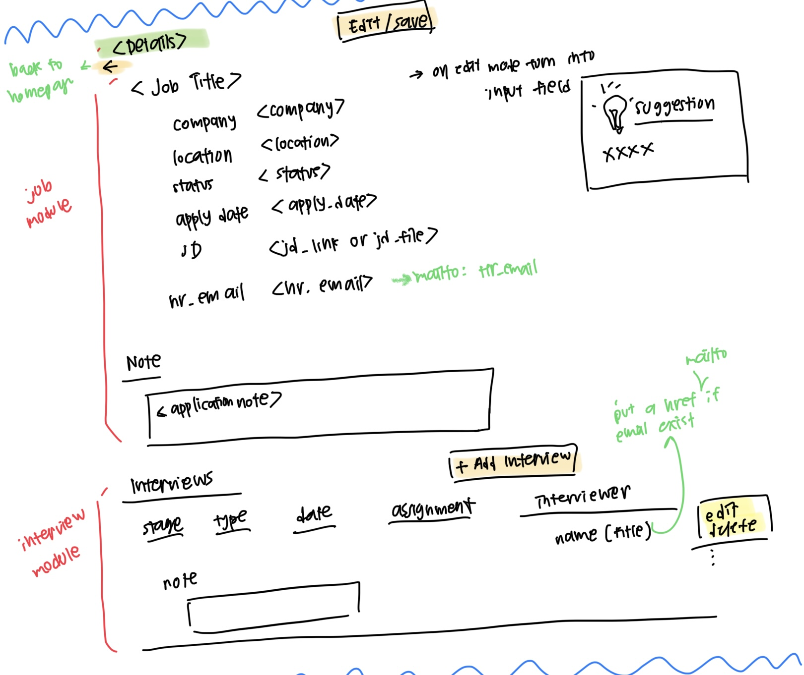

# trackr

A simple job tracking application that eventually will allow user to automate their job searching processes

## Technologies Used

Main stack:

- PostgreSQL (`pg` and `pg-format`)
- Express
- React
- Node

Additional library:

- Typescript
- React Router v6
- Material UI
- JSONWebToken
- Axios

## Approach

1. Create all the designs first
2. Implement and test all the backend functions and API endpoints
3. Build front end components and connect the existing endpoints to the components
4. Whenever there are additional features that I think would be good to add (e.g. undo function when deleting interview), I would first consider whether the feature can be done in the front-end with the existing endpoints. If it's not possible, then I would create a new endpoint.

## Installation

To run this web app locally:

1. Clone this project

```
git clone https://github.com/orlinromy/fridge-tracker.git
```

2. Install the packags

```
npm i
```

3. Open 2 terminals:
   - Terminal 1:
     1. `cd server`
     2. `npm i`
     3. `npm run dev` or `nodemon` if you have it installed
   - Terminal 2:
     1. `cd client`
     2. `npm i`
     3. `npm start`

## User stories

- User can register, login, and logout
- User can view the list of their existing job applications in 2 modes: kanban board and table view, add a new application, edit their existing application, and delete their applications
- User can update the status of their application by moving the cards in the kanban board
- User should be able to add scheduled interview, remove interviews, and add more details to their interviews

## Design

### Database


### APIs

| Method | Address                  | Description                                                 |
| ------ | ------------------------ | ----------------------------------------------------------- |
| POST   | /sessions/login          | User login                                                  |
| DELETE | /sessions/logout         | User logout                                                 |
| PUT    | /users/register          | User registration                                           |
| POST   | /jobs/job                | Get the list of user's job application                      |
| PUT    | /jobs/job                | Create a new job application                                |
| PATCH  | /jobs/job                | Edit a job application                                      |
| DELETE | /jobs/job                | User registration                                           |
| PATCH  | /jobs/status             | Edit the status of job application (used for kanban board)  |
| POST   | /jobs/oneJob             | Get the user's job application detail by jobId              |
| PUT    | /interviews/interview    | Add an interview                                            |
| PATCH  | /interviews/interview    | Edit an interview                                           |
| DELETE | /interviews/interview    | Delete an interview                                         |
| POST   | /interviews/interview    | Get all interviews                                          |
| POST   | /interviews/oneInterview | Get all interviews based on the jobId provided in the input |

### Front-end





### Snippets from the app


## Unsolved Problems and Further Development

- Integration with gmail for login
- Error handling could be more robust
- Figure out how to use refresh token to generate access token properly
- Email parsing to automate interview scheduling
- Create a job sprint
- Toggle between dark and light mode
- (If possible) Automate data population from job searching websites

## Major Hurdles

- First time building something using Typescript

  I encountered a lot of type errors when I build this project, but overall it is a good learning experience.

- Lack of planning for the front-end components
